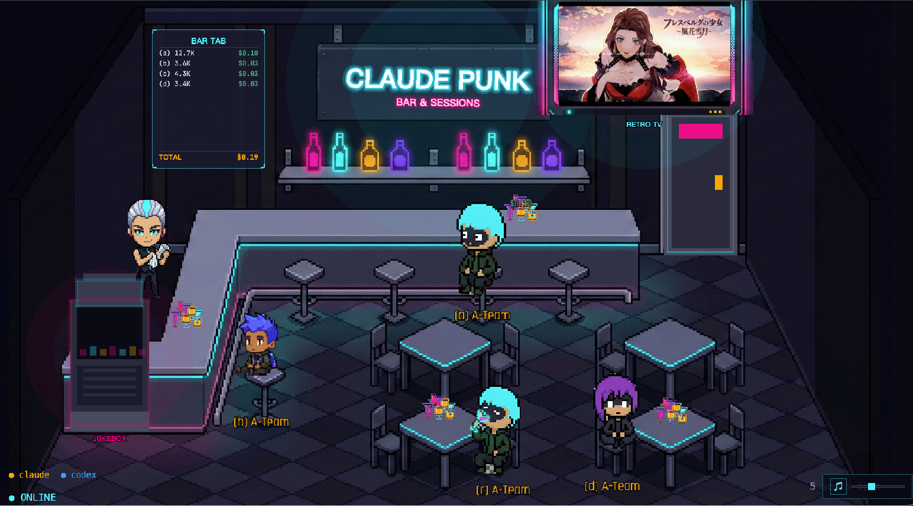

# Claude Punk
 <br>
A cyberpunk pixel-art bar game that turns AI coding agents into bar patrons. Each agent (Claude / Codex) spawns as a chibi character, walks to a seat, and works on your codebase — you can watch their terminal output in real time while they sip drinks at the bar.


## Screenshots

<p align="center">
  <br>
  <em>caption 1</em>
</p>

<p align="center">
  <br>
  <em>caption 2</em>
</p>

<p align="center">
  <br>
  <em>caption 3</em>
</p>

<p align="center">
  <br>
  <em>caption 4</em>
</p>

## How It Works

1. You pick a project folder via the in-game door
2. A coding agent (Claude or Codex) spawns in a terminal session
3. The agent appears as a character in the bar, walks to a seat and starts working
4. Click on a character to see their terminal output, file tree, and config
5. The more files in the project, the more drinks appear on the table

## Prerequisites

Before you begin, make sure you have the following installed:

### Node.js (v20+)

```bash
# macOS (Homebrew)
brew install node

# Or use nvm
nvm install 20
nvm use 20
```

### node-pty dependencies
```
sudo apt-get update
sudo apt-get install -y make python build-essential
```

### Claude Code CLI

This project spawns Claude Code as a subprocess. Install it globally:

```bash
npm install -g @anthropic-ai/claude-code
```

After installing, run `claude` once to complete the authentication flow (you'll need an Anthropic API key or a Claude Pro/Team subscription).

### OpenAI Codex CLI (optional)

If you want to use Codex agents in addition to Claude:

```bash
npm install -g @openai/codex
```

Run `codex` once to authenticate with your OpenAI API key.

## 📦 macOS App (Recommended for End Users)

**Want to use CLAUDE PUNK without setting up development environment?** Download the standalone macOS app!

### Download & Install

1. **Download** the latest `.dmg` from [Releases](https://github.com/chemistrywow31/CLAUDE-PUNK/releases)
2. **Drag** CLAUDE PUNK.app to your Applications folder
3. **Double-click** to launch (macOS may show security warning on first run - click "Open")

### Features

- ✅ **Zero Configuration** - Just double-click and play
- ✅ **Auto-Start Services** - Automatically starts backend & frontend
- ✅ **Smart Port Detection** - Reuses existing services if already running
- ✅ **One-Click Restart** - Press `Cmd+Shift+R` to restart services
- ✅ **Auto-Cleanup** - Automatically stops all services when app quits

### Keyboard Shortcuts

- `Cmd+,` - Open Preferences
- `Cmd+Shift+R` - Restart Services
- `Cmd+R` - Reload Window
- `Cmd+Q` - Quit (auto-stops all services)

### Configuration

Settings file location:
```
~/Library/Application Support/CLAUDE PUNK/config.json
```

Edit ports, Claude CLI path, and other settings:
```bash
# Open in Finder
open "~/Library/Application Support/CLAUDE PUNK"
```

After editing, press `Cmd+Shift+R` to apply changes.

### Troubleshooting

**App won't start?**
- Check logs: `~/Library/Logs/CLAUDE PUNK/main.log`
- Or use menu: Help > View Logs

**Port conflicts?**
- Change ports in config.json (see above)
- Default ports: 3000 (backend), 5173 (frontend)

**Claude CLI not found?**
- Install: `npm install -g @anthropic-ai/claude-code`
- Or set custom path in Preferences

For detailed documentation, see [ELECTRON_PACKAGING.md](ELECTRON_PACKAGING.md)

---

## Getting Started (For Developers)

### 1. Clone the repo

```bash
git clone <repo-url>
cd claude-punk
```

### 2. Install backend dependencies

```bash
cd backend
npm install
```

> **Note:** `node-pty` is a native module and requires build tools. On macOS you need Xcode Command Line Tools (`xcode-select --install`). On Linux you need `build-essential` and `python3`.

### 3. Install frontend dependencies

```bash
cd ../frontend
npm install
```

### 4. One-Click Startup (Recommended) ⚡

```bash
# From project root
./start.sh
```

This script will:
- ✅ Check and kill any processes using ports 3000/5173
- ✅ Start backend on http://127.0.0.1:3000
- ✅ Start frontend on http://localhost:5173
- ✅ Open browser automatically
- ✅ Display logs and status

To stop:
```bash
# Press Ctrl+C in the terminal, or run:
./stop.sh
```

### Alternative: Manual Startup

If you prefer to start services manually:

**Terminal 1 - Backend:**
```bash
cd backend
npm run dev
```

**Terminal 2 - Frontend:**
```bash
cd frontend
npm run dev
```

Then open `http://localhost:5173` in your browser.

Vite automatically proxies `/ws` and `/api` requests to the backend, so everything works through a single URL.

## Usage

1. Open `http://localhost:5173` in your browser
2. Click the **door** on the right side of the bar to open the folder picker
3. Select a project directory — a new agent session spawns
4. The character walks from the door to an empty seat
5. Click on a seated character to open the dialog panel with 3 tabs:
   - **Terminal** — live terminal output from the agent
   - **Files** — file tree of the project directory
   - **Config** — `.claude/` configuration files

## Project Structure

```
claude-punk/
├── backend/              # Node.js backend
│   ├── server.js         # Single-file entry point (Express + WebSocket + PTY)
│   └── package.json
├── frontend/             # Phaser.js + Vite frontend
│   ├── src/
│   │   ├── main.js       # Phaser game bootstrap
│   │   ├── scenes/       # Game scenes (bar, boot)
│   │   ├── entities/     # Character sprites and behaviors
│   │   ├── ui/           # HTML/CSS overlay panels
│   │   ├── services/     # WebSocket client, state management
│   │   ├── config/       # Game constants and configuration
│   │   └── styles/       # CSS files
│   ├── index.html
│   └── vite.config.js
└── readme.md
```

## Tech Stack

| Layer | Technology |
|-------|-----------|
| Game engine | Phaser 3 (640x360, pixel-perfect) |
| Terminal UI | xterm.js |
| Frontend build | Vite |
| Backend runtime | Node.js (ES modules) |
| HTTP server | Express |
| WebSocket | ws (raw WebSocket, JSON envelope protocol) |
| PTY management | node-pty |
| File watching | chokidar |

## Configuration

The backend has a `CONFIG` object at the top of `server.js` with tunable values:

| Variable | Default | Description |
|----------|---------|-------------|
| `PORT` | `3000` | Backend port (env var) |
| `AUTO_RUN_CLAUDE` | `true` | Auto-start the agent when a session is created |
| `maxSessions` | `16` | Maximum concurrent agent sessions |
| `fileCountRatio` | `20` | Files per drink (`drinkCount = floor(fileCount / 20)`) |

## Troubleshooting

**`node-pty` fails to install**
Make sure you have native build tools: `xcode-select --install` on macOS, or `sudo apt install build-essential python3` on Ubuntu/Debian.

**"claude: command not found" when a session starts**
Install the Claude CLI globally: `npm install -g @anthropic-ai/claude-code`, then run `claude` once to authenticate.

**WebSocket connection fails**
Make sure the backend is running on port 3000 before starting the frontend. Vite proxies WebSocket traffic to the backend.

**Port already in use**
Kill the existing process or change the port: `PORT=3001 node server.js` (and update `vite.config.js` proxy target accordingly).

## dev team
  - dev team agent created by [A-Team](https://github.com/chemistrywow31/A-Team) (Claude Code multi-agent system for team design) 
